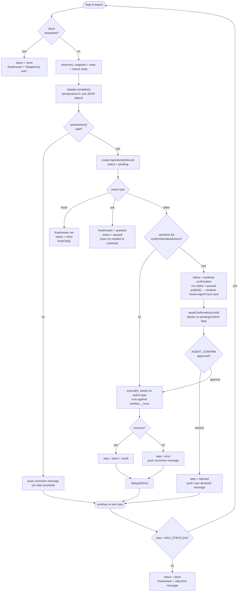

# Nova Agents

Nova's tagline is "the AI is the browser," and the autonomous browsing agent
is where that stops being marketing copy. This document explains how the
agent actually works — the ReAct loop, the injected page controller, the
strict action schema, and the human-in-the-loop confirmation gate — all
grounded in `src/main/ai/agent/agent-runner.ts`, `action-parser.ts`, and
`page-controller.ts`. It then honestly maps the "multi-agent" vision against
what v0.1 actually ships, and closes with a concrete recipe for adding a new
action type.

## 1. What exists today: one agent, two surfaces

Nova v0.1 has exactly two AI-driven surfaces, and only one of them acts on
the world:

- **Chat** (`ChatService`, `src/main/ai/chat-service.ts`) — a conversational
  assistant that can read the current page (via `PageContextService`) and
  answer, summarize, translate, or rewrite. It never clicks or types
  anything; it only produces text.
- **The Browser agent** (`AgentRunner`, `src/main/ai/agent/agent-runner.ts`) —
  a single autonomous agent that can navigate, click, type, select, scroll,
  wait, and extract text on a real Chromium tab, driven by an LLM in a loop,
  gated by human confirmation for anything sensitive.

There is no planner that decomposes a goal across specialist agents, no
scheduler, and no persistent multi-agent orchestration — see §4 for the full
comparison against the broader vision. Everything below describes that one
`AgentRunner`.

## 2. The ReAct loop

`AgentRunner.loop()` implements a classic **observe → plan → act** cycle
(ReAct-style: the model reasons about the current page state and emits one
concrete action, rather than planning an entire multi-step script up front).
It runs for at most `MAX_STEPS = 24` iterations per run.

### Observe

`observe(wc, state)` re-injects the page-controller `INSTALL_SCRIPT` (cheap
no-op if already installed — see §3) and evaluates two expressions inside the
tab's `WebContents`:

- `META_EXPR` → `{ url, title, selection }`
- `SNAPSHOT_EXPR` → the numbered list of visible, interactive elements (see
  §3)

It also renders a "RECENT STEPS" block from the last six entries in
`state.steps`, each formatted with `describeAction()`
(`src/main/ai/prompts.ts` — a terse one-liner like `Click #12` or `Type "SF" into #4`)
plus an error suffix if the step failed. The final observation string looks
like:

```
GOAL: <the user's goal>
URL: <current url>
TITLE: <current title>
ELEMENTS:
[0] link "Sign in"
[1] input:search "Search products"
...
RECENT STEPS:
- Click #1 → done
- Type "wireless mouse" into #1 → done
...
Respond with exactly one JSON action.
```

This is pushed onto the model's transcript as a `'user'` message.

### Plan

`AgentRunner` calls `registry.adapterFor()` — the same provider abstraction
`ChatService` uses — and then `adapter.complete({ model, messages: transcript,
temperature: 0, maxTokens: 700 })`. This is a **non-streaming** call
(`complete()`, not `stream()`): the loop needs one finished JSON object per
step, not a token stream to render live, and `temperature: 0` biases toward
deterministic, schema-conformant output. The system message driving this
call is `AGENT_SYSTEM` from `src/main/ai/prompts.ts`, which tells the model
explicitly: *"You must respond with EXACTLY ONE JSON object and nothing
else — no prose, no code fences."* The raw reply is pushed back onto the
transcript as an `'assistant'` message (so the model sees its own prior
actions on the next step) and handed to `parseAction()`.

### Parse + validate

If `parseAction()` returns `{ ok: false }`, the loop does **not** record a
step. It instead pushes a corrective `'user'` transcript message describing
the parse error and `continue`s — the model gets one more turn to
self-correct, without polluting the visible step history with a malformed
attempt.

If parsing succeeds, an `AgentActionRecord` (`{ id, action, status: 'pending', at }`)
is created and pushed into `state.steps` — this is the point at which a step
becomes visible in the renderer's `AgentTrace` UI.

### Act (with a confirmation branch)

Before executing, the loop checks three terminal cases and one gate:

- **`type === 'finish'`** — the run is done. `state.finalAnswer` is set from
  `action.message`, status becomes `'done'`, `finishTab()` clears the
  agent-controlled flag on the tab, and the loop returns.
- **`type === 'ask'`** — the agent needs information only the human has.
  `state.finalAnswer` is set to the question, status becomes `'paused'`, and
  the loop returns. This is a real limitation worth stating plainly: `ask`
  does not suspend and later resume *the same run* waiting for a reply — the
  code comment in `agent-runner.ts` says it directly, "the renderer surfaces
  the question; the user's reply arrives as a new run." A user's answer
  starts a fresh `agent.run()` call rather than continuing the paused one.
- **Confirmation gate** — `needsConfirm = action.sensitive &&
  settings.get().confirmSensitiveActions`. If true: the step's status flips
  to `'awaiting-confirmation'`, the run's status flips to `'paused'`, the
  state is published (so the UI shows the amber confirmation card
  immediately), and the loop `await`s `this.awaitConfirmation(state.id)` —
  which blocks until a human responds. See §5 for the full mechanics.
  - If declined, the step is marked `'rejected'` with error `'User declined
    this action.'`, a corrective transcript message is pushed ("The user
    declined that action. Choose a safe alternative or finish."), and the
    loop `continue`s — the run is **not** aborted, the agent gets to try
    something else.
- **Execution** — otherwise (or after approval), the step's status becomes
  `'running'`, the run's status becomes `'acting'`, and `execute(wc, action,
  state)` runs the action against the page (§3). On success the step is
  marked `'done'` with a result string; on failure it's marked `'error'` and
  a corrective transcript message is pushed so the model can adapt. Either
  way the loop `await sleep(350)` — "let the page settle / SPA transitions
  finish" — before observing again.

If the loop exhausts all 24 steps without reaching `'done'` or `'paused'`,
it force-finishes: status `'done'`, `finalAnswer` defaults to `"Reached the
step limit before completing the goal."`, and `finishTab()` is called.



## 3. The injected page controller (`window.__nova`)

The agent never receives a DOM tree or screenshot from the model's
perspective — it receives a **numbered list of elements** and issues
**index-based commands**, all mediated by a small JS program the main process
injects into the tab via `webContents.executeJavaScript()`. This program
lives entirely in `src/main/ai/agent/page-controller.ts` as the
`INSTALL_SCRIPT` string constant (an IIFE, so it can be evaluated repeatedly
without leaking globals beyond the one namespace it creates).

**Idempotency.** The very first line checks `if (window.__nova &&
window.__nova.__v === 1) return 'already';` — since both `AgentRunner` and
`PageContextService` re-inject the script defensively before every read
(pages can navigate, reloading the JS world), this guard makes repeated
injection a cheap no-op rather than redefining the object each time.

**`window.__nova` methods:**

| Method | Behavior |
|---|---|
| `snapshot()` | Re-scans the DOM for `a, button, input, textarea, select, [role=button], [role=link], [role=tab], [role=menuitem], [onclick], [contenteditable=true]`, filters to elements passing `isVisible()` (real bounding-box size, non-hidden computed style, in-viewport with a 50px margin) and not `disabled`, assigns each a fresh sequential index into an internal `registry` array, and returns up to 120 lines formatted `[idx] kind "text"` (kind is the tag name, `input:<type>`, `link`, or an ARIA role; text comes from innerText/value/placeholder/aria-label/title, collapsed and capped at 80 chars) |
| `readable()` | Clones `document.body`, strips `script, style, noscript, svg, nav, footer, header, aside, [aria-hidden=true]`, collapses runs of blank lines, and returns up to 20,000 chars of the remaining text — a cheap reader-mode extraction used for the `extract` action and for `PageContextService` |
| `meta()` | `{ url: location.href, title: document.title, selection: String(getSelection() \|\| '') }` |
| `click(i)` | Looks up element `i` in the registry, `scrollIntoView({block:'center', behavior:'instant'})`, then `.click()` |
| `type(i, value)` | Scrolls/focuses the element; for `contentEditable` sets `.textContent`; otherwise sets `.value` through the **native property setter** (`Object.getOwnPropertyDescriptor(prototype, 'value').set`) to bypass React's synthetic-event value tracking on the target page, then dispatches both `input` and `change` events with `bubbles: true` so any framework listening on the page picks up the change |
| `select(i, value)` | Matches an `<option>` by exact value, exact trimmed text, or case-insensitive substring; throws if nothing matches; sets `.value` and dispatches `change` |
| `scroll(dir)` | `'top'` → `scrollTo(0)`; `'bottom'` → `scrollTo(document.body.scrollHeight)`; `'up'`/`'down'` → `scrollBy(±85% of innerHeight)` |

`_el(i)` is the shared registry lookup; if the index is stale (the page
re-rendered and indices shifted) it throws `'No element #' + i + ' (page may
have changed; re-snapshot)'` — a message specifically written to be legible
to the model on the next planning turn, not just a developer.

**JS-expression builders.** `AgentRunner.execute()` doesn't call these
methods directly (it's driving a *different* process's `WebContents`, not
running in-page JS itself) — it evaluates small expression strings via
`wc.executeJavaScript(...)`. `page-controller.ts` exports the builders that
produce those strings, each `JSON.stringify`-encoding its arguments so
values embed safely: `SNAPSHOT_EXPR`, `READABLE_EXPR`, `META_EXPR` (plain
constants), and `clickExpr(index)`, `typeExpr(index, value)`,
`selectExpr(index, value)`, `scrollExpr(direction)` (functions). These same
exports are shared by `PageContextService.getContext()` for the *chat*
surface's "read the current page" feature — one injected controller, two
independent consumers.

## 4. The strict JSON action schema

Every planning turn must produce **exactly one** `AgentAction` object
(`src/shared/types.ts`). The closed vocabulary, `AgentActionType`, has nine
members:

```ts
type AgentActionType =
  | 'navigate' | 'click' | 'type' | 'scroll' | 'select'
  | 'wait' | 'extract' | 'ask' | 'finish'
```

`AGENT_SYSTEM` (`src/main/ai/prompts.ts`) shows the model the full shape
inline:

```
{reasoning, type: "navigate|click|type|scroll|select|wait|extract|ask|finish",
 url, target, value, direction, ms, message, sensitive}
```

but the actual enforcement — the ground truth for what's accepted — is
`parseAction()` in `src/main/ai/agent/action-parser.ts`, which validates
per-type:

| Type | Required / defaulted fields |
|---|---|
| `navigate` | `url` required, must match `/^https?:\/\//i` |
| `click` | `target` required, must be numeric |
| `type` | `target` required (numeric) **and** `value` required (string) |
| `select` | `target` required (numeric) **and** `value` required (string) |
| `scroll` | `direction` defaults to `'down'` if not one of `up\|down\|top\|bottom` |
| `wait` | `ms` defaults to `1000`, clamped to a maximum of `10000` |
| `extract` | no extra fields |
| `ask` | `message` defaults to `''` |
| `finish` | `message` defaults to `''` |

**JSON extraction.** Models don't always emit *only* JSON despite being
told to — they add stray prose, or wrap output in code fences.
`extractJsonObject(text)` is a hand-rolled, string-and-escape-aware
balanced-brace scanner: it walks the text tracking brace depth, correctly
ignoring braces that appear inside quoted string values (including escaped
quotes), and returns the first complete `{...}` object it finds. This is
what lets `parseAction()` tolerate a reply like `` Here's my action:\n```json\n{...}\n``` `` without failing.

**The safety backstop.** After field validation, for `navigate` and `click`
actions specifically, `parseAction()` builds a haystack from `url +
reasoning` and tests it against:

```
/\b(pay|checkout|purchase|buy|order|login|log in|sign in|delete|confirm)\b/i
```

If it matches, `action.sensitive` is forced to `true` **regardless of what
the model set** — the model's own judgment about what's sensitive is not
trusted as the sole line of defense; this keyword check is a deterministic
backstop underneath it.

## 5. The human-in-the-loop confirmation gate

The mechanism is deliberately simple: a single `Map<string, (approved:
boolean) => void>` called `pendingConfirm`, keyed by `runId`.

- **`awaitConfirmation(runId)`** returns `new Promise<boolean>(resolve =>
  this.pendingConfirm.set(runId, resolve))`. The loop `await`s this promise
  directly inside `loop()` — execution of that `for` iteration is
  genuinely suspended at that `await` until something calls the stored
  resolver.
- **`confirm(runId, actionId, approved)`** — called from `IPC.AGENT_CONFIRM`
  — looks up and calls the resolver for `runId` with `approved`. The
  `actionId` parameter exists in the method signature (and is threaded all
  the way from `AgentTrace.tsx`'s button handlers through
  `confirmAgent()` in `lib/controller.ts` through the preload) but is **not
  actually used** to disambiguate inside `confirm()` — because only one
  confirmation can ever be in flight per run (the loop is single-threaded
  per run and blocks on the `await` before planning the next step), the
  run id alone is sufficient today. This is worth knowing if the loop is
  ever changed to support concurrent or speculative actions.
- **`abort(runId)`** sets an abort flag checked at the top of the next loop
  iteration, **and** immediately resolves any pending confirmation for that
  run as `false` — so clicking "Stop" while a confirmation card is showing
  doesn't leave the loop parked forever waiting for a reply that will never
  come.

On the renderer side, `AgentTrace.tsx` finds
`run.steps.find(s => s.status === 'awaiting-confirmation')` and, if present,
renders an amber "Confirmation required" card: *"Nova wants to {description}.
This looks sensitive — approve it?"* with Approve/Decline buttons that call
`confirmAgent(true/false)` in `src/renderer/src/lib/controller.ts`, which
resolves the run's pending step id and calls `window.nova.agent.confirm(run.id,
pending?.id ?? '', approved)`. Whether or not the gate fires at all is itself
user-controlled: `SettingsPage.tsx`'s single Safety toggle,
`settings.confirmSensitiveActions` (on by default), is checked by
`AgentRunner.loop()` on every sensitive action — a user can turn confirmation
off entirely if they choose to trust the agent unattended, though the
underlying `sensitive` flag and safety-backstop keyword match are computed
either way.

## 6. Multi-agent vision vs. v0.1 reality

The long-term vision for Nova includes a roster of specialized agents:
Planner, Browser, Research, Coding, Writing, Shopping, Travel, Email,
Automation, and Memory agents, coordinated to handle complex, multi-domain
tasks. Being direct about where v0.1 actually stands:

| Vision role | v0.1 status |
|---|---|
| **Browser** | **Implemented.** This is `AgentRunner` exactly as described above — the only agent that acts on web pages today. |
| **Planner** | **Not implemented.** There is no component that decomposes a high-level goal into sub-tasks routed to different specialist agents. `AgentRunner` plans its *own* next single step, not a multi-agent task graph. |
| **Memory** | **Partially implemented, not agentic.** `MemoryService` (`src/main/services/memory-service.ts`) is a real, working feature — it stores typed facts/habits/style/prompts/tasks/notes and `buildContextBlock()` injects them into every chat and agent system prompt. But it is a passive CRUD store with prompt injection, not an autonomous agent that observes, decides what's worth remembering, or manages its own knowledge — there's no auto-capture, no summarization-into-memory, no independent reasoning loop. |
| **Research** | **Not implemented as a distinct agent.** The Browser agent *can* be given a research-shaped goal ("find the top 3 reviews for X") and will navigate/extract/read pages toward it, and chat can read a page in context — but there's no dedicated multi-source synthesis agent, no citation tracking, no report-writing pipeline. |
| **Coding, Writing, Shopping, Travel, Email** | **Not implemented as distinct agents.** None of these have dedicated system prompts, tool sets, or code paths. Chat can *write* prose (including code snippets) as a text-generation task, and the Browser agent could in principle be pointed at a shopping or travel site and given a goal — but there is no specialized handling, vertical-specific prompting, or dedicated UI for any of these domains. |
| **Automation** | **Not implemented.** There is no scheduler, no saved/repeatable workflow concept, and no trigger system (time-based or event-based). Every agent run is a one-off `agent.run(goal, tabId)` invocation initiated live by a human. See `docs/ROADMAP.md` for how this is sequenced. |
| **Voice** | **Not implemented, but scaffolded in settings.** `NovaSettings` (`src/shared/types.ts`) already has `voiceEnabled: boolean` and `wakeWord: string` fields (defaulting to `false` / `'Hey Nova'`), and `SettingsPage.tsx`... actually does not yet even expose a control for them — they exist purely as forward-compatible schema, with zero STT/TTS/WebRTC/microphone code anywhere in the repo. |

The honest summary: **v0.1 is "Chat + one autonomous Browser agent," full
stop.** Everything else in the roster is future work, and none of it should
be implied as present in any user-facing copy until it exists in code.

## 7. Extending the agent: adding a new action type

Adding a new `AgentActionType` touches five files, in this order:

1. **`src/shared/types.ts`** — add the new literal to the `AgentActionType`
   union, and add any new fields the action needs to the `AgentAction`
   interface (most actions can reuse the existing generic fields — `target`,
   `value`, `url`, `message` — before you need to add something new).

   ```ts
   export type AgentActionType =
     | 'navigate' | 'click' | 'type' | 'scroll' | 'select'
     | 'wait' | 'extract' | 'ask' | 'finish'
     | 'screenshot' // example: a new action type
   ```

2. **`src/main/ai/agent/action-parser.ts`** — add the literal to
   `VALID_TYPES`, then add a `case` in the per-type validation switch inside
   `parseAction()` for any required/defaulted fields your action needs
   (following the existing pattern — e.g. throw/return an error result if a
   required field is missing or the wrong type, or default an optional
   field). If the new action can plausibly be sensitive (irreversible, costs
   money, exposes data), extend the safety-backstop regex or add an
   equivalent explicit check.

3. **`src/main/ai/agent/page-controller.ts`** (only if the action needs a new
   in-page primitive) — add a method to the `window.__nova` object inside
   `INSTALL_SCRIPT` if the browser needs a new capability (the existing
   methods cover click/type/select/scroll/snapshot/readable/meta; a genuinely
   new capability — e.g. a screenshot trigger, a drag gesture — needs its own
   method here). Then export a corresponding `<name>Expr(...)` builder
   function that `JSON.stringify`s its arguments into a safe
   `window.__nova.<method>(...)` call string, matching the existing
   `clickExpr`/`typeExpr`/`selectExpr`/`scrollExpr` pattern.

4. **`src/main/ai/agent/agent-runner.ts`** — add a `case` to the `switch
   (action.type)` inside `execute()` that calls
   `wc.executeJavaScript(yourNewExpr(...))` (if it needs the page controller)
   or does main-process work directly (like `wait` does with `sleep()`, or
   `navigate` does by calling `bridge.navigate()`), and returns a short
   human-readable result string (this string is stored in the step's
   `result` field and surfaced in the trace UI).

5. **`src/main/ai/prompts.ts`** — add the new type to `AGENT_SYSTEM`'s
   inline schema description so the model knows it exists and when to use
   it, and add a `case` to `describeAction()` for the terse scratch-history
   line the model sees in its own transcript.

6. **`src/renderer/src/lib/describe.ts`** — add a `case` to `describeStep()`
   for the **human-facing** description shown in `AgentTrace.tsx` (this is
   deliberately a separate function from `describeAction()` in
   `prompts.ts` — one is written for the model's transcript, the other for a
   person reading the trace UI, and they can phrase the same action
   differently).

No other files need to change: `AgentRunner.loop()`'s control flow (the
`finish`/`ask`/confirmation/execute branches) is generic over `action.type`
and does not need new special cases unless the new action introduces a new
*terminal* or *pausing* semantic (in which case it belongs alongside the
existing `finish`/`ask` checks in `loop()`, not just in `execute()`).
