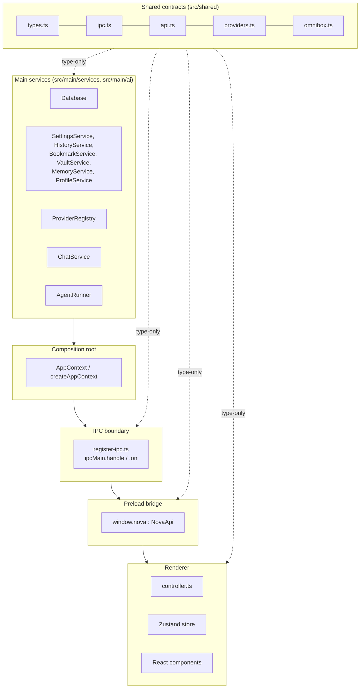
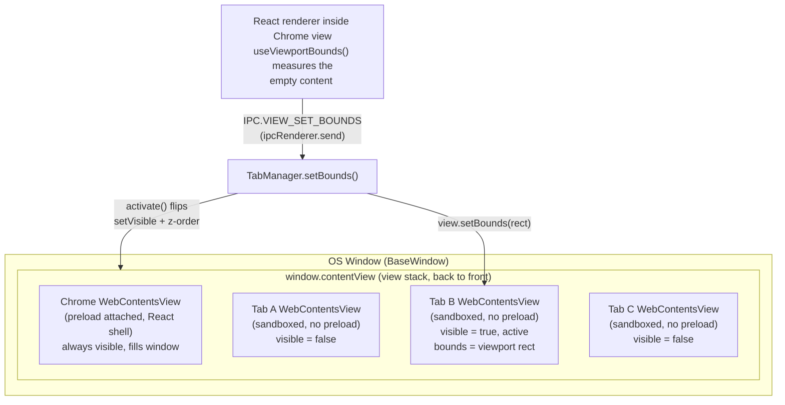
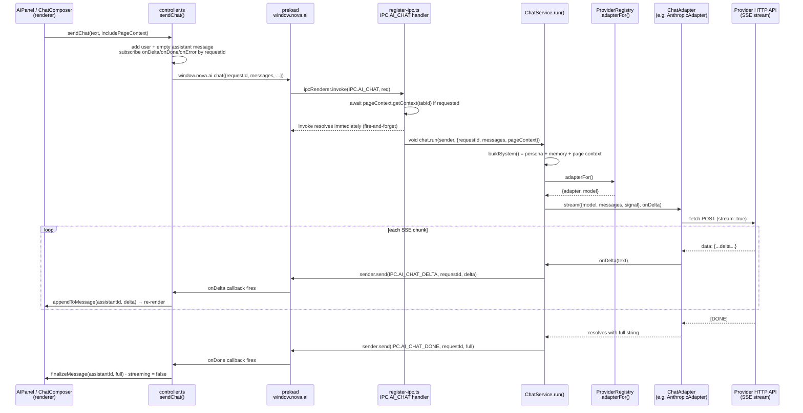

# Nova Architecture

Nova is an Electron browser whose premise is "the AI is the browser" — the
autonomous agent and the chat sidebar are not bolt-on features but sit at the
same architectural layer as tab management. This document describes how the
codebase under `src/` is actually organized to support that premise: the
three-process model electron-vite builds, the Clean Architecture layering
that keeps the main process testable, the tab-rendering model built on
`BaseWindow` + `WebContentsView`, the data flow for a streaming chat turn, the
storage layer, and the security boundaries that keep untrusted web content
away from the OS.

Every class, file, and IPC channel named below exists in the codebase as
written; nothing here is aspirational (see `docs/ROADMAP.md` for what is not
yet built).

## 1. The three-process model

Electron enforces a hard process boundary: a single **main** process (Node.js
+ Electron APIs), one or more **renderer** processes (Chromium, sandboxed),
and a **preload** script that runs in the renderer's JS context but with
privileged access to Node before `contextBridge` seals it off. Nova maps its
own responsibilities onto exactly this split:

| Process | Entry point | Runs | Trust level |
|---|---|---|---|
| Main | `src/main/index.ts` | Node.js, all Electron APIs, network `fetch` to LLM providers, SQLite | Fully trusted |
| Preload | `src/preload/index.ts` | Isolated JS world attached to the chrome renderer only | Trusted, minimal surface |
| Renderer (chrome) | `src/renderer/src/main.tsx` → `App.tsx` | React 18, Zustand, no Node | Trusted UI, untrusted input |
| Renderer (web tabs) | N/A (loads arbitrary URLs) | Sandboxed Chromium, no Node, no preload | Untrusted |

**electron-vite** (`electron.vite.config.ts`) builds all three targets from
one TypeScript source tree in a single command (`electron-vite dev` /
`electron-vite build`):

- `main` target — bundles `src/main/index.ts` and everything it imports
  (`core/`, `services/`, `ai/`, `ipc/`) into `out/main/index.js`, with
  `externalizeDepsPlugin()` so native/CJS dependencies like `sql.js` and
  `electron` are not bundled, just required at runtime.
- `preload` target — bundles `src/preload/index.ts` into
  `out/preload/index.js` the same way, since it also runs under Node's module
  system (Electron's preload context).
- `renderer` target — a genuine Vite/React build rooted at `src/renderer`,
  bundling `index.html` and `src/renderer/src/**` into `out/renderer/`. This
  is the only target that runs in a browser-like (sandboxed) JS environment.

All three targets share one alias, `@shared` → `src/shared`, configured
identically in each block of `electron.vite.config.ts`. That is what makes
`src/shared` a true single source of truth: the same `types.ts` and `ipc.ts`
files are compiled into the main bundle, the preload bundle, and the renderer
bundle, so a type change is caught by `tsc` on every side that imports it.
Two separate `tsconfig` projects enforce this split at typecheck time:
`tsconfig.node.json` covers `src/main`, `src/preload`, `src/shared` (Node/CJS
module resolution), and `tsconfig.web.json` covers `src/renderer`, `src/shared`
(DOM lib, JSX). `npm run typecheck` runs both.

At runtime, `src/main/index.ts` decides where the renderer loads from:
`process.env['ELECTRON_RENDERER_URL']` (injected by `electron-vite dev` for
the Vite dev server with HMR) or, in production, `file://.../out/renderer/index.html`.

## 2. Clean Architecture layering

Nova's main process is written so dependencies point in one direction only —
inward, toward pure logic — and are wired in exactly one place. This is the
classic Clean Architecture / hexagonal shape, applied pragmatically rather
than dogmatically:



**Layer 1 — shared contracts (`src/shared/`).** Pure data: `types.ts` (every
domain shape — `TabState`, `ChatMessage`, `AgentAction`, `NovaSettings`, …),
`ipc.ts` (the `IPC` channel-name registry), `api.ts` (the `NovaApi` interface
the preload must implement), `providers.ts` (the static `PROVIDER_CATALOG`),
`omnibox.ts` (the dependency-free `classifyOmni` heuristic, which is pure
enough to run identically in main and renderer). Nothing in this layer imports
Electron or React. Every other layer imports *from* it, never the reverse.

**Layer 2 — main services.** Each service takes its dependencies through its
constructor and never constructs its own collaborators. For example
`HistoryService`, `BookmarkService`, `VaultService`, `MemoryService`, and
`ProfileService` (all in `src/main/services/`) each take only a `Database`
handle. `ChatService` (`src/main/ai/chat-service.ts`) takes a
`ProviderRegistry` and a `MemoryService`. `AgentRunner`
(`src/main/ai/agent/agent-runner.ts`) takes a `PageBridge`, a
`ProviderRegistry`, a `SettingsService`, and an emit callback. None of these
classes reach into a global or singleton to get what they need — everything
arrives as a constructor argument, which is what makes each one legible and
swappable in isolation.

**Layer 3 — composition root (`src/main/core/app-context.ts`).**
`createAppContext()` is the *only* function in the codebase that is allowed to
know how the full graph fits together. It runs once, in order: initializes
`Database`, builds the six storage services on top of it, builds
`ProviderRegistry` and `ChatService`, builds `TabManager` (which also *is* the
`PageBridge`), builds `PageContextService` on top of the tabs, then builds
`AgentRunner` wired to the tab bridge + AI + settings, and finally
`DownloadManager`. The returned `AppContext` object is a plain struct of every
wired service; `src/main/index.ts` holds onto it just long enough to call
`registerIpc(context)` and `buildMenu(context)`.

**Layer 4 — the IPC boundary (`src/main/ipc/register-ipc.ts`).** One file
registers every `ipcMain.handle`/`ipcMain.on` binding by channel constant from
`IPC`. Handlers are intentionally thin — they destructure `AppContext` and
delegate straight to a service method; the file is a manifest of "everything
the untrusted renderer can ask the privileged process to do," making the
trust boundary auditable in one read.

**Layer 5 — the preload bridge (`src/preload/index.ts`).** The single file
allowed to import `ipcRenderer` directly. It implements the `NovaApi`
interface from `src/shared/api.ts` field-for-field and calls
`contextBridge.exposeInMainWorld('nova', api)`. Every subscription method
(`onChanged`, `onDelta`, `onUpdate`, …) returns an `Unsubscribe` closure so
React effects can clean up listeners without leaking.

**Layer 6 — the renderer.** `src/renderer/src/lib/controller.ts` is the
imperative glue: it is the only module that calls `window.nova.*` directly
(besides a few direct calls from components for simple one-shot actions like
`window.nova.tabs.create()`), and it reads/writes the single Zustand store in
`src/renderer/src/state/store.ts`. React components (`App.tsx` and everything
under `components/`) are declarative consumers of that store.

### Dependency inversion in practice: AgentRunner ↔ TabManager

The clearest example of dependency inversion in the codebase is the
relationship between the autonomous agent and the Chromium tab layer.
`AgentRunner` needs to drive a real browser tab, but it must not depend on
`TabManager` — a concrete, Electron-heavy class — directly, or the agent
becomes untestable and the layering inverts (a "business logic" module
reaching down into infrastructure).

Instead, `src/main/ai/agent/agent-runner.ts` defines the interface it needs
for itself:

```ts
export interface PageBridge {
  getWebContents(tabId: string): WebContents | null
  createTab(url: string): Promise<string>
  navigate(tabId: string, url: string): Promise<void>
  setAgentControlled(tabId: string, controlled: boolean): void
}
```

`AgentRunner`'s constructor takes `private bridge: PageBridge` — nothing more
specific. `src/main/core/tab-manager.ts` then declares
`export class TabManager implements PageBridge` and implements exactly those
four methods (`getWebContents`, `createTab`, `navigate`,
`setAgentControlled`) alongside its full tab-lifecycle surface (`create`,
`close`, `activate`, `back`, `forward`, `reload`, `reorder`, `pin`, `getAll`,
`setBounds`). `createAppContext()` is the only place that connects the two:
`new AgentRunner(tabs, registry, settings, emit)` passes the concrete
`TabManager` instance in as the abstract `PageBridge`. The agent module
depends only on the interface it declares; `TabManager` depends on nothing
from the agent module at all. The same pattern recurs for `ChatAdapter`
(`src/main/ai/providers/types.ts`), which `ChatService` and `AgentRunner` both
consume without knowing whether the concrete instance is
`OpenAIAdapter`, `AnthropicAdapter`, `GeminiAdapter`, or `OllamaAdapter`.

## 3. The tab rendering model

Nova does not use Electron's deprecated `BrowserView`. It uses a
`BaseWindow` (`src/main/index.ts`) holding a stack of `WebContentsView`
instances, layered by `TabManager` (`src/main/core/tab-manager.ts`):

- **One chrome view**, created once in `createWindow()`, sized to the full
  window content bounds and resized on the window's `resize` event. It is the
  *only* `WebContentsView` whose `webPreferences.preload` points at
  `out/preload/index.js`; it runs the React chrome (sidebar, toolbar, AI
  panel, internal pages).
- **One `WebContentsView` per open tab**, created by `TabManager.create()`.
  Each tab view is constructed with
  `{ partition: profiles.activePartition(), sandbox: true, contextIsolation: true, nodeIntegration: false }`
  — no preload, no Node, an isolated session partition per browsing profile.

`TabManager` keeps every tab's view attached to `window.contentView` at all
times, but only one is `setVisible(true)` and positioned over the content
"hole" left by the chrome — `activate()` walks every managed tab, marks the
target `isActive`, and calls `setVisible` accordingly, then calls
`tab.view.setBounds(this.bounds)` and re-adds it as the topmost child view so
it paints above the chrome. Switching tabs is therefore just a visibility +
z-order flip, not a destroy/recreate.

The chrome doesn't know the pixel geometry of the content area on its own —
the renderer measures it. `src/renderer/src/lib/useViewportBounds.ts` attaches
a `ResizeObserver` (plus a `window resize` listener and a 16&nbsp;ms interval
for ~400&nbsp;ms to track animated transitions) to an empty `<div>` in
`App.tsx` that exists purely as a layout placeholder, and calls
`window.nova.tabs.setBounds({x, y, width, height})` on every measurement. That
reaches `TabManager.setBounds()` over the `view:set-bounds` (`IPC.VIEW_SET_BOUNDS`)
channel, a fire-and-forget `ipcRenderer.send`/`ipcMain.on` (not `invoke`,
since no reply is needed). `App.tsx` re-runs the observer whenever
`sidebarOpen`, the active tab's `internalPage`, or the active tab id changes,
which is what keeps the native view glued to the DOM slot through the AI
panel's animated width transition.

When the active tab is showing one of Nova's own pages (`internalPage !==
null` — new tab, settings, history, bookmarks, downloads), `TabManager` hides
that tab's `WebContentsView` (`loadUrl()` calls `tab.view.setVisible(false)`)
and the React `InternalRouter` renders the corresponding page directly inside
the chrome, on top of the now-empty viewport slot. This is why internal pages
share the app's glassmorphic look — they are chrome-rendered React, not remote
web content.



## 4. Data flow for a chat turn

The AI sidebar (`AIPanel.tsx`) streams tokens from whichever provider is
active, through the main process, back to the renderer, delta by delta. Every
piece of this path is real code, not a simplification:

1. **Renderer, `ChatComposer`/`AIPanel` → `sendChat()`** in
   `src/renderer/src/lib/controller.ts`. It generates a `requestId`, pushes a
   user `ChatMessage` and an empty streaming assistant placeholder into the
   Zustand store, subscribes to `window.nova.ai.onDelta/onDone/onError`
   filtered by that `requestId`, and builds the `LlmMessage[]` history from
   the existing transcript.
2. **Preload passthrough.** `window.nova.ai.chat(req)` is
   `ipcRenderer.invoke(IPC.AI_CHAT, req)` — one line in `src/preload/index.ts`.
3. **IPC boundary, `IPC.AI_CHAT` handler** in `src/main/ipc/register-ipc.ts`.
   If `includePageContext` and a `tabId` are present, it awaits
   `pageContext.getContext(tabId)` first, then calls `chat.run(...)`
   *without awaiting it* ("fire-and-forget; deltas stream back over dedicated
   event channels") so the `invoke` resolves immediately and the UI isn't
   blocked on the full generation.
4. **`ChatService.run()`** (`src/main/ai/chat-service.ts`) builds the system
   prompt via `buildSystem()` — concatenating `NOVA_PERSONA`
   (`src/main/ai/prompts.ts`), `MemoryService.buildContextBlock()`, and
   `pageContextBlock(pageContext)` — registers an `AbortController` keyed by
   `requestId` in `this.inflight` (so `AI_ABORT` can cancel it later), and
   calls `this.registry.adapterFor()`.
5. **`ProviderRegistry.adapterFor()`** (`src/main/ai/provider-registry.ts`)
   resolves the active `ProviderId` from `SettingsService`, decrypts the
   stored API key via `safeStorage` if the provider requires one, and
   `switch`es on the catalog's `api` field (`'openai' | 'anthropic' |
   'gemini' | 'ollama'`) to construct the matching `ChatAdapter`
   (`OpenAIAdapter`, `AnthropicAdapter`, `GeminiAdapter`, or `OllamaAdapter`),
   throwing a friendly "needs an API key" error if credentials are missing.
6. **`adapter.stream(opts, onDelta)`** — each adapter (in
   `src/main/ai/providers/`) POSTs to its provider's streaming endpoint with
   `fetch`, and iterates the response with the shared helpers in `sse.ts`
   (`readSse` for OpenAI/Anthropic/Gemini's `data:` framing, `readLines` for
   Ollama's newline-delimited JSON). Each adapter parses its own event shape
   (`choices[].delta.content` for OpenAI-style, `content_block_delta` for
   Claude, `candidates[].content.parts` for Gemini, `message.content` for
   Ollama) and calls `onDelta(text)` for every non-empty chunk, accumulating
   the full string to return at the end.
7. **`onDelta` inside `ChatService.run()`** is `(delta) =>
   send(IPC.AI_CHAT_DELTA, requestId, delta)`, where `send` is a
   destroyed-check wrapper around `sender.send(...)` — `sender` is the
   `WebContents` of the chrome view that originated the `invoke`
   (`event.sender`), so the delta always targets the right renderer.
8. **Preload → renderer.** `window.nova.ai.onDelta(cb)` in
   `src/preload/index.ts` subscribes via the shared `on()` helper, which wraps
   `ipcRenderer.on(IPC.AI_CHAT_DELTA, ...)` and hands back an unsubscribe
   function.
9. **Store update.** The `sendChat()` closure's `onDelta` handler calls
   `useStore.getState().appendToMessage(assistantId, delta)`, which
   concatenates onto the assistant message's `content` and keeps
   `streaming: true`; React re-renders `AIPanel` and the `Markdown` component
   re-parses the growing string on every delta.
10. **Completion.** On finish, `ChatService.run()` sends `IPC.AI_CHAT_DONE`
    with the full accumulated string (used to reconcile the transcript in
    case any deltas raced or were dropped); on error it sends
    `IPC.AI_CHAT_ERROR`; a user-triggered `AbortController` abort resolves as
    an empty `AI_CHAT_DONE` rather than an error. Either event tears down the
    per-request listeners (`cleanup.forEach(c => c())`) and clears
    `isStreaming`.



The autonomous agent's step loop (`AgentRunner.loop()`) reuses the same
`adapterFor()` / `ChatAdapter` machinery but calls `adapter.complete()`
(non-streaming) instead of `adapter.stream()`, since each step needs one
complete JSON object rather than a token stream — see `docs/AGENTS.md` for
that loop in full.

## 5. Storage

Nova's only persistence mechanism is **sql.js** — SQLite compiled to
WebAssembly — wrapped by `src/main/services/database.ts`. The module
docstring states the rationale directly: it needs no per-platform native
compilation, so the same `Database` class runs unmodified on Windows/macOS/
Linux, at the cost of the database living fully in memory and needing an
explicit export-to-disk step.

- **Location.** `join(app.getPath('userData'), 'nova-data', 'nova.sqlite')`.
- **Lifecycle.** `Database.init()` calls `initSqlJs({ locateFile })` to load
  the WASM engine (resolving the `.wasm` binary next to the installed
  `sql.js` package rather than assuming a cwd), restores the file from disk
  with `readFileSync` if it exists or starts a fresh `SQL.Database()`, then
  runs the idempotent `SCHEMA` string (`CREATE TABLE IF NOT EXISTS …`) to
  ensure `history`, `bookmarks`, `vault`, `memory`, `profiles`, and a
  generic `kv` (key/value) table all exist.
- **Writes.** Every mutating call (`run()`) triggers `scheduleFlush()`, a
  400&nbsp;ms debounce that calls `db.export()` and `writeFileSync` once a
  burst of writes settles, so many rapid inserts cost one disk write.
  `Database.close()` (invoked from `app.on('before-quit')` in
  `src/main/index.ts`) flushes synchronously so no data is lost on quit.
- **Reads.** `query<T>()` prepares a statement, binds params, and steps
  through rows via `getAsObject()`; `get<T>()` is a single-row convenience
  wrapper.

Six services sit directly on top of `Database`, each owning one table and
translating between the DB row shape and the `@shared/types` domain shape:

| Service | Table | Notes |
|---|---|---|
| `SettingsService` | `kv` (key `settings`) | One JSON blob, cached in memory; `NovaSettings` defaults live in the service |
| `HistoryService` | `history` | De-dupes revisits to the same URL within 30s by updating `visited_at` instead of inserting |
| `BookmarkService` | `bookmarks` | Simple CRUD, folder is a plain string column |
| `VaultService` | `vault` | See encryption below |
| `MemoryService` | `memory` | Also exposes `buildContextBlock()`, which `ChatService` folds into every system prompt |
| `ProfileService` | `profiles` + `kv` (key `active_profile`) | Seeds a default "Personal" profile on first run; exposes `activePartition()` as `persist:profile-<id>`, consumed by `TabManager.create()` |

`ProviderRegistry` (`src/main/ai/provider-registry.ts`) also persists through
`Database`, using the generic `kv` table directly (keys
`provider_key_<id>` and `provider_model_<id>`) rather than a dedicated table,
since provider config is small and doesn't need its own schema.

**Encryption.** Two categories of secret are encrypted at rest via Electron's
`safeStorage` API, which delegates to the OS credential store (Keychain on
macOS, DPAPI on Windows, libsecret on Linux):

- **Vault passwords** (`VaultService.save()`) — `safeStorage.encryptString(password)`,
  stored as base64 ciphertext in `vault.secret`. `reveal()` is the sole path
  back to plaintext, callable only via the explicit `IPC.VAULT_REVEAL`
  channel from a deliberate user action; if `safeStorage.isEncryptionAvailable()`
  is false, `save()` throws rather than ever writing plaintext to disk.
- **Provider API keys** (`ProviderRegistry.setKey()`) — same
  `encryptString`/`decryptString` pattern, with a plaintext fallback to plain
  base64 *only* if OS encryption is unavailable (still not human-readable at
  rest, but not cryptographically protected either). Decrypted keys are
  cached in an in-memory `Map` (`keyCache`) for the process lifetime so
  `safeStorage.decryptString` isn't called on every single LLM request, but
  the key is never sent to the renderer — `ProviderConfig.configured` is a
  boolean, never the key itself.

## 6. Security model

Nova's security posture rests on four mechanisms, all visible directly in the
process-creation code:

1. **Sandboxed, Node-less web tabs.** Every tab's `WebContentsView`
   (`TabManager.create()`) is created with
   `sandbox: true, contextIsolation: true, nodeIntegration: false`, and — this
   is the key point — **no `preload` script at all**. Remote page JavaScript
   therefore has zero path to Node APIs, zero path to Electron APIs, and zero
   path to `window.nova`. The only privileged surface a tab has is whatever
   `webContents.executeJavaScript()` main-process code chooses to inject into
   it (the agent's `window.__nova` controller — see `docs/AGENTS.md` — which is
   plain DOM-manipulating JS, not an IPC bridge).
2. **Context isolation everywhere, one bridge.** The chrome view *does* carry
   a preload (`contextIsolation: true`, `sandbox: false` — the chrome needs
   Node module resolution for its bundle, but still runs its JS world isolated
   from the page's), and that preload's only privileged action is
   `contextBridge.exposeInMainWorld('nova', api)`. `src/preload/index.ts` is
   the single file in the whole renderer-reachable surface allowed to import
   `ipcRenderer` — every other renderer module reaches main only through
   `window.nova`, which is exactly the `NovaApi` shape and nothing more.
3. **An auditable IPC allowlist.** Because every handler is registered in one
   file (`src/main/ipc/register-ipc.ts`) against named constants from `IPC`
   (`src/shared/ipc.ts`), the full set of operations the renderer can trigger
   in the main process is enumerable by reading one file top to bottom — there
   is no scattered `ipcMain.handle` elsewhere in the codebase.
4. **The sensitive-action confirmation gate.** The autonomous agent can act on
   real web pages — click, type, submit, navigate — so Nova requires an
   explicit human approval step before anything the model or a keyword
   heuristic flags as risky. `parseAction()`
   (`src/main/ai/agent/action-parser.ts`) force-sets `action.sensitive = true`
   for `navigate`/`click` actions whose URL or reasoning text matches
   `/\b(pay|checkout|purchase|buy|order|login|log in|sign in|delete|confirm)\b/i`,
   as a backstop even if the model forgets to flag itself. `AgentRunner.loop()`
   checks `action.sensitive && settings.get().confirmSensitiveActions` (the
   latter a user-toggleable setting, on by default) and, if true, parks the
   step in `awaiting-confirmation` status and `await`s a promise that only
   resolves when the renderer calls `IPC.AGENT_CONFIRM` — the step blocks
   indefinitely until a human clicks Approve or Decline in `AgentTrace.tsx`.
   Declining feeds "the user declined that action" back into the agent's
   transcript so it can choose a different, non-sensitive path instead of
   retrying blindly. Full mechanics are in `docs/AGENTS.md`.

Additional hardening visible in the code: the renderer's `index.html` sets a
restrictive `Content-Security-Policy` (`default-src 'self'`, plus explicit
allowances for Google Fonts and `data:`/`https:` images); `chromeView.webContents
.setWindowOpenHandler` denies in-app popups and routes them to
`shell.openExternal` instead; and each tab's own `setWindowOpenHandler`
(`TabManager.wireEvents`) redirects `target=_blank`/`window.open` into a new
Nova tab rather than an uncontrolled child window.

## 7. File-by-file map

### `src/shared/` — cross-process contracts

| Path | Responsibility |
|---|---|
| `src/shared/types.ts` | Every domain type shared by main and renderer: tabs (`TabState`, `InternalPage`, `PageContext`), profiles/history/bookmarks/downloads, `VaultEntry`, AI/provider types (`ProviderId`, `ProviderConfig`, `ChatMessage`, `LlmMessage`, `LlmRequest`), the agent's closed action vocabulary (`AgentActionType`, `AgentAction`, `AgentActionRecord`, `AgentRunState`), omnibox (`OmniIntent`, `OmniClassification`), and settings/memory (`NovaSettings`, `MemoryEntry`, `MemoryKind`) |
| `src/shared/ipc.ts` | The `IPC` object: every channel name as a string constant, grouped by domain, with the `<domain>:<verb>` / `<domain>:event:<name>` naming convention documented inline |
| `src/shared/api.ts` | The `NovaApi` interface the preload implements and the renderer consumes as `window.nova`; also defines `ChatTurnRequest` and the `Unsubscribe` type |
| `src/shared/providers.ts` | `PROVIDER_CATALOG` (static metadata for openai/anthropic/gemini/grok/deepseek/ollama: labels, base URLs, model lists, which adapter API style each uses), `DEFAULT_PROVIDER`, `PROVIDER_ORDER` |
| `src/shared/omnibox.ts` | `classifyOmni()` — the dependency-free heuristic that turns raw omnibox text into `{intent, value, confidence}`; also `normalizeUrl()` and `searchUrl()` |

### `src/main/` — main process

| Path | Responsibility |
|---|---|
| `src/main/index.ts` | Process entry point: creates the `BaseWindow`, creates and lays out the chrome `WebContentsView`, loads the renderer (dev server or built file), calls `createAppContext()`, `registerIpc()`, `buildMenu()`, opens the first tab, wires app lifecycle (`window-all-closed`, `before-quit` → `db.close()`) |
| `src/main/core/app-context.ts` | The composition root: `createAppContext()` constructs and wires the entire service graph in dependency order and returns the `AppContext` struct |
| `src/main/core/tab-manager.ts` | `TabManager` — owns all tab `WebContentsView`s: create/close/activate/navigate/back/forward/reload/reorder/pin, viewport bounds, internal-page routing (`nova://` URLs), event wiring (title/favicon/loading/navigation), and implements `PageBridge` for the agent |
| `src/main/core/download-manager.ts` | `DownloadManager` — attaches to Electron sessions' `will-download`, tracks progress per item, exposes `list()`/`open()`, notifies the renderer on change |
| `src/main/core/menu.ts` | `buildMenu()` — native application menu and global shortcuts (New Tab, Close Tab, Reload, Back/Forward, Toggle AI Sidebar, DevTools), delegating to the same `AppContext` services the UI uses |
| `src/main/core/util.ts` | `id()` (short UUID-based id generator), `originOf()`, `sleep()`, `clamp()` |
| `src/main/ipc/register-ipc.ts` | `registerIpc()` — binds every `IPC` channel constant to a thin handler that delegates to the corresponding `AppContext` service; the complete map of what the renderer can invoke |
| `src/main/services/database.ts` | `Database` — sql.js (WASM SQLite) wrapper: schema bootstrap, `run`/`query`/`get`, debounced flush-to-disk, synchronous `close()` |
| `src/main/services/settings-service.ts` | `SettingsService` — typed, in-memory-cached `NovaSettings` persisted as one JSON blob in the `kv` table |
| `src/main/services/history-service.ts` | `HistoryService` — records navigations (skips internal pages, de-dupes rapid revisits), search/list/delete/clear |
| `src/main/services/bookmark-service.ts` | `BookmarkService` — CRUD over bookmarks grouped by folder |
| `src/main/services/vault-service.ts` | `VaultService` — password manager: `safeStorage`-encrypted secrets, `save`/`list`/`reveal`/`remove`/`findForOrigin` |
| `src/main/services/memory-service.ts` | `MemoryService` — long-term user memory (facts/habits/style/prompts/tasks/notes) plus `buildContextBlock()` for prompt injection |
| `src/main/services/profile-service.ts` | `ProfileService` — browsing profiles mapped to isolated Electron session partitions; seeds a default "Personal" profile |
| `src/main/services/page-context-service.ts` | `PageContextService` — injects the page-controller install script into a tab and extracts a `PageContext` snapshot (readable text, title, url, selection) for the AI |
| `src/main/ai/chat-service.ts` | `ChatService` — assembles the system prompt (persona + memory + page context), calls the active adapter's `stream()`, relays deltas/done/error over IPC, tracks in-flight requests for abort |
| `src/main/ai/prompts.ts` | `NOVA_PERSONA`, `pageContextBlock()`, `AGENT_SYSTEM` (the agent's strict JSON-action system prompt), `describeAction()` (terse scratch-history serializer) |
| `src/main/ai/provider-registry.ts` | `ProviderRegistry` — encrypted key storage, active-provider/model tracking, `adapterFor()` factory that constructs the right `ChatAdapter` |
| `src/main/ai/providers/types.ts` | `ChatAdapter` interface (`stream`, `complete`), `AdapterCallOptions`, `AdapterCredentials` |
| `src/main/ai/providers/sse.ts` | Shared streaming helpers: `readLines()`, `readSse()` (SSE `data:` framing + `[DONE]` sentinel), `assertOk()` |
| `src/main/ai/providers/openai-adapter.ts` | `OpenAIAdapter` — OpenAI Chat Completions wire format; also serves Grok and DeepSeek (same API shape, different base URL/key) |
| `src/main/ai/providers/anthropic-adapter.ts` | `AnthropicAdapter` — Claude Messages API (`system` as top-level field, `content_block_delta` streaming events) |
| `src/main/ai/providers/gemini-adapter.ts` | `GeminiAdapter` — Generative Language API (`contents`/`parts`, `systemInstruction`, key as query param, `streamGenerateContent?alt=sse`) |
| `src/main/ai/providers/ollama-adapter.ts` | `OllamaAdapter` — local Ollama server, newline-delimited JSON instead of SSE, no API key |
| `src/main/ai/agent/agent-runner.ts` | `AgentRunner` — the ReAct loop (observe → plan → confirm? → act), run/confirm/abort lifecycle, `PageBridge` interface definition |
| `src/main/ai/agent/action-parser.ts` | `parseAction()` — extracts and validates the model's one-JSON-object-per-step reply against the `AgentAction` schema, with a sensitive-action safety backstop |
| `src/main/ai/agent/page-controller.ts` | The `window.__nova` install script (element snapshot/labeling, readable-text extraction, click/type/select/scroll primitives) plus the JS-expression builders `AgentRunner` evaluates each step |

### `src/preload/`

| Path | Responsibility |
|---|---|
| `src/preload/index.ts` | Implements `NovaApi` over `ipcRenderer`, exposes it as `window.nova` via `contextBridge`; the only file permitted to touch raw `ipcRenderer` |

### `src/renderer/` — chrome UI

| Path | Responsibility |
|---|---|
| `src/renderer/index.html` | Renderer HTML shell: CSP meta tag, Google Fonts preconnect, mounts `#root`, loads `main.tsx` |
| `src/renderer/src/main.tsx` | Renderer entry: mounts `<App />`, calls `bindBridgeEvents()` and `bootstrap()` |
| `src/renderer/src/App.tsx` | Top-level layout: sidebar + toolbar/content column + AI panel; hosts the measured viewport `<div>` and `InternalRouter`/`AgentOverlay` |
| `src/renderer/src/global.d.ts` | Ambient `declare global { interface Window { nova: NovaApi } }` |
| `src/renderer/src/state/store.ts` | The single Zustand store: tabs, chat messages/streaming state, agent run, downloads, providers/settings, derived `activeTab()` |
| `src/renderer/src/lib/controller.ts` | Imperative orchestration: `bindBridgeEvents()`, `bootstrap()`, `sendChat()`, `runAgent()`, `confirmAgent()`, `submitOmni()` |
| `src/renderer/src/lib/describe.ts` | `describeStep()` — human-friendly (not model-friendly) descriptions of `AgentAction`s for the trace UI |
| `src/renderer/src/lib/markdown.tsx` | Dependency-free Markdown → HTML renderer (`renderMarkdown`) and `<Markdown>` component, scoped to the subset chat output needs |
| `src/renderer/src/lib/useViewportBounds.ts` | `useViewportBounds()` hook — measures a ref's bounding rect and reports it to main via `window.nova.tabs.setBounds` |
| `src/renderer/src/components/AIPanel.tsx` | The AI sidebar: header + provider picker, chat transcript, embedded `AgentTrace`, composer, empty-state quick actions |
| `src/renderer/src/components/AgentOverlay.tsx` | Floating "Nova is controlling this tab…" banner shown over the web viewport while the agent is acting on the currently visible tab |
| `src/renderer/src/components/AgentTrace.tsx` | Live step-by-step agent run log, status glyphs, and the Approve/Decline confirmation UI for sensitive actions |
| `src/renderer/src/components/ChatComposer.tsx` | Chat input: textarea, page-context toggle, classifies submit text to route to `runAgent` vs `sendChat` |
| `src/renderer/src/components/Omnibox.tsx` | Unified URL/search/ask/command input with live intent badge |
| `src/renderer/src/components/TabSidebar.tsx` | Arc-style vertical tab rail: brand header, new-tab button, animated tab list, bottom nav to internal pages |
| `src/renderer/src/components/Toolbar.tsx` | Top bar: back/forward/reload, `Omnibox`, bookmark toggle, AI-panel toggle, frameless window controls (non-macOS) |
| `src/renderer/src/components/internal/InternalRouter.tsx` | Maps a tab's `internalPage` to the corresponding internal React page component |
| `src/renderer/src/components/internal/PageShell.tsx` | Shared layout frame (title/description/actions) for internal pages |
| `src/renderer/src/components/internal/NewTabPage.tsx` | Home surface: natural-language command bar, quick shortcuts, example capability prompts |
| `src/renderer/src/components/internal/SettingsPage.tsx` | Provider configuration (API keys, model pickers, active provider), general prefs (search engine, language), safety toggle (`confirmSensitiveActions`) |
| `src/renderer/src/components/internal/HistoryPage.tsx` | Searchable history list with delete/clear |
| `src/renderer/src/components/internal/BookmarksPage.tsx` | Bookmarks grouped by folder with remove |
| `src/renderer/src/components/internal/DownloadsPage.tsx` | Live download list with progress bars, open-on-complete |
| `src/renderer/src/styles/index.css` | Global styles: glassmorphic surfaces, drag regions, scrollbars, Markdown typography, streaming caret animation |

### Build & packaging config

| Path | Responsibility |
|---|---|
| `package.json` | Scripts (`dev`, `build`, `start`, `typecheck`, `dist*`), dependencies (React 18, Zustand, sql.js, framer-motion, lucide-react, clsx) and devDependencies (Electron 33, electron-vite, electron-builder, Tailwind, TypeScript 5.6) |
| `electron.vite.config.ts` | The three-target electron-vite build config (`main`/`preload`/`renderer`), `@shared` and `@renderer` aliases |
| `electron-builder.yml` | Packaging targets: macOS (dmg/zip, hardened runtime), Windows (nsis/portable), Linux (AppImage/deb) |
| `tsconfig.json` | Root project-references file pointing at `tsconfig.node.json` and `tsconfig.web.json` |
| `tsconfig.node.json` | Typecheck project for `src/main`, `src/preload`, `src/shared` |
| `tsconfig.web.json` | Typecheck project for `src/renderer`, `src/shared` (DOM lib, JSX) |
| `tailwind.config.js` | Nova's design tokens: `ink`/`surface`/`nova`/`accent` color system, font families, radii, animations |
| `postcss.config.js` | Tailwind + autoprefixer pipeline |
